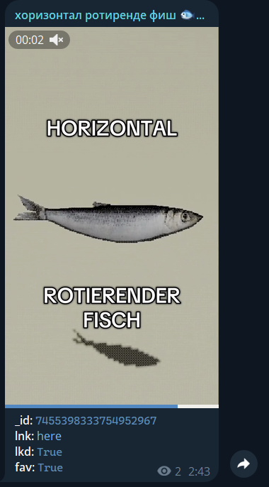

# tikdog
*Woof!*  
A small watchdog that monitors your TikTok likes and saves and forwards them to your Telegram channel.

 <video src="res/fisch.mp4" height=500>

[Essential tricks](#essential-tricks) • [Adopt](#adopt) • [TODO](#todo) • [Technical notes](#technical-notes)
# Essential tricks
- **Fire and forget:** reliably fetches every your TikTok, updating TG posts if necessary
- **Dumb in a good way:** doesn't use external databases, while still preventing double-posting
- **Keen on learning:** has a few planned features that will be added in next releases

# Adopt
1. Get the repository
2. Create and populate `.env` file in the repository root.  
The example is...
    ```
    TT_COOKIE="a-very-long-cookie-header-string-from-browser"
    TT_DEVICE_ID="device-id-header-from-browser"
    TT_USERNAME="your-username-without-@"

    TG_APP_ID="your-telegram-app-id"
    TG_APP_HASH="your-telegram-app-hash"
    TG_BOT_TOKEN="your-telegram-bot-that-will-be-posting-token"
    TG_CHANNEL_ID="your-telegram-channel-that-we-will-be-posting-to"
    ```
3. Install dependencies by running...
    ```
    uv install
    ```
4. Let the dog out with...
    ```
    uv run tikdog
    ```

You're all set!

# TODO
- [x] tiktok fetching
    - [x] fetch liked videos
    - [x] fetch saved videos
    - [ ] warn if TikTok is blocked by legal laws
- [x] telegram posting
    - [x] fetch current posts
    - [x] post new ones
    - [ ] do not require app ID and hash
    - [ ] dynamically update posts if information changes
- [ ] misc features
    - [ ] automatically generate captions for videos
    - [ ] more instructions in README
    - [ ] docker container
    - [ ] "traditional" installation (pip)
    - [ ] docstrings
    - [ ] better logging
    - [ ] funny logo

# Technical notes
### Startup time could be slow
The approximate limits are:
- *1000 fetched TikTok posts per minute*  
- *10 posted Telegram posts per minute*

On every run, all your TikTok and Telegram posts will be fetched
to keep track of missed posts and prevent double-posting.  
With a lot of likes restarts could be slow.  
Next fetches will retrieve only new posts, so updating should be fast.

On the very first run, all your historic likes will be posted in Telegram.  
Posting has a very conservative limit, so first sync will be even slower.  
Next runs will check what was already posted and should be faster.

### Fetched TikTok list is empty
If TikTok is blocked in your country, its APIs will work as before, just not returning any data.
Try a VPN. There wouldn't be a way to circumvent this in this library, but a sanity check should be added.

### Mess in `tiktok.py`
I don't really like it too. However, that's the only way to keep `.env` loading organized and still inject
device ID for the whole thing to work.

### Disappearing post in Telegram channel
That's the way of determining latest post ID, by sending a new one and immediately deleting it.
Shouldn't be noticeable, as it's using a silent message, but sometimes can still show up.
